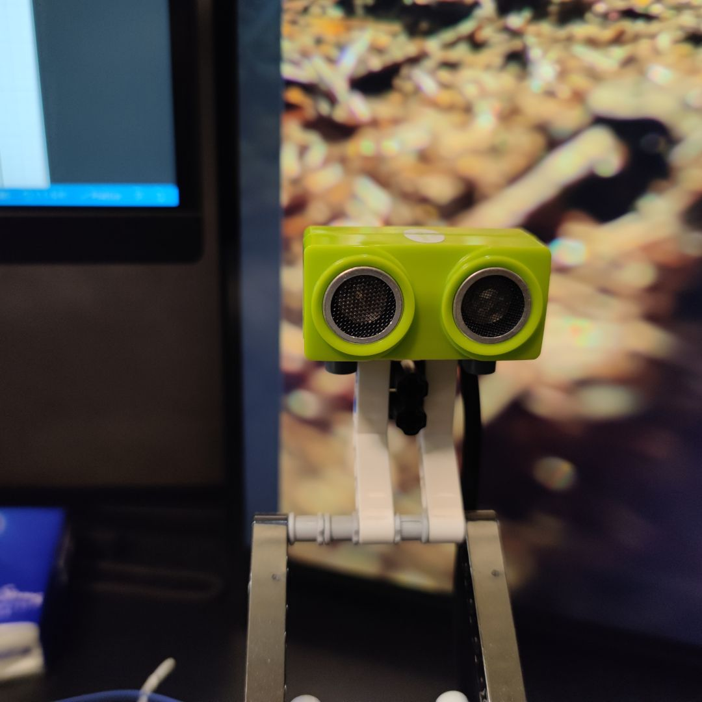

# 乐高魔方机器人

基于开源硬件 Arduino Mega2650 和 [MindCuber](http://mindcuber.com) 打造最便宜、兼容多款魔方、高成功率的乐高魔方机器人。
所有硬件都是某宝可以买到，关键是要价格亲民。

已测试兼容的魔方
- 大雁孤鸿4代 (稳定且识别率高)
- 小米智能魔方
- 奇艺魔方

## 代码分支

- ev3 分支基于 Lego EV3 套装，机械部分改动小，适合初级玩家，马达采用 Lego 原装马达
- spike 分支基于 Lego Spike 套装，但为了测试兼容性，动力部分采用某宝国产兼容 Lego 马达，而且机械部分改动较大，适合有一定动手能力的玩家
## 方案选择

- 积木部分
  - ev3 分支选择乐高 EV3 套装， 拼搭说明见 [How to build MindCub3r for LEGO MINDSTORMS EV3](http://mindcuber.com/mindcub3r/mindcub3r.html)
  - spike 分支选择乐高 Spike 套装， 拼搭说明见 [How to build PrimeCuber for LEGO Education SPIKE Prime](http://mindcuber.com/primecuber/primecuber.html)
- 程序部分参考 [MindCuber 源码](http://mindcuber.com/mindcuber/mindcuber-source.html)
- 主控 Arduino Mega2650
- 传感器控制板 [Bricktronics Megashield](https://github.com/wayneandlayne/BricktronicsHardware)
- 颜色传感器 [TCS34725](assets/tcs34725.png)
- 乐高马达或国产兼容马达
- 超声波传感器使用 HCSR04
- ADKeyboard

## 依赖

安装到 Arduino 的 libraries
- [BricktronicsMegashield](https://github.com/wayneandlayne/BricktronicsMegashield)
- [BricktronicsMotor](https://github.com/wayneandlayne/BricktronicsMotor)

使用 Arduino IDE 安装

- Adafruit_BusIO
- Adafruit_TCS34725
- HCSR04
- LiquidCrystal_I2C

## 硬件成本

| 器件                    | 数量 | 成本 (RMB) | 描述 |
| ----------------------- | ---- | ---------- | ---- |
| Arduino Mega2650        | 1    | 40         | -    |
| Bricktronics Megashield | 1    | 15         | -    |
| TCS34725                | 1    | 6.5        | -    |
| Lego Ev3大马达          | 2    | 80         | -    |
| Lego Ev3中马达          | 1    | 70         | -    |
| HCSR04超声波传感器      | 1    | 15.5       | -    |
| ADKeyboard              | 1    | 4          | -    |
| LCD1602A                | 1    | 10         | -    |
| 18650锂电池             | 2    | 10         | -    |
| 合计                    | -    | 341        | -    | - |

## 搭建说明

机械部分

- ev3 分支使用 EV3 套装，拼搭说明见 [How to build MindCub3r for LEGO MINDSTORMS EV3](http://mindcuber.com/mindcub3r/mindcub3r.html)
- spike 分支选择乐高 Spike 套装， 拼搭说明见 [How to build PrimeCuber for LEGO Education SPIKE Prime](http://mindcuber.com/primecuber/primecuber.html)

底盘马达接 Megashield 的 Motor1 端口 , 翻转马达接 Megashield 的 Motor2 端口 , 扫描马达接 Megashield 的 Motor3 端口

### 运行

如果使用锂电池供电，需要确保电池电量充足。

- 上传代码
- 按下ADKeyboard 的 `确认按钮` 启动机器人
- 按下ADKeyboard 的 `左右按钮` 校准底盘位置，确保垂直于中轴线
- 放入打乱的魔方，机器人会自动识别并还原
### 超声波传感器

使用 Megashield 的 Sensor1 端口, 用跳线连接 4 和 5 脚，Echo 接 RJ12 的 6 脚, Trig 接 5 脚, Vcc 接 4 脚, Gnd 接 3 脚, 其余留空

### 颜色传感器

TCS34725 双孔版本,使用 I2C 连接 Megashield

拼装所需乐高配件:

| 编号  | 数量 |
| ----- | ---- |
| 41678 | 1    |
| 22961 | 2    |
| 18654 | 2    |
| 60483 | 2    |
| 6575  | 2    |

改造图示:

### LCD1602A

使用 I2C 连接 Megashield

### ADKeyboard
使用 Megashield 的 Sensor2 端口, 用跳线连接 3 和 4 脚， Out 接 RJ12 的 6 脚, Vcc 接 4 脚, Gnd 接 3 脚, 其余留空

### 转盘的改造

为了减小魔方在转盘中的活动空间，使扫描位置更精确，使用 8 个 42610 替换原先的 62462。

改造图示:

参考：
https://tengxiao.wang/index.php/archives/38/

### 触碰传感器的改造

` 本项目的Spike分支才有用到触碰传感器 `

BricktronicsButton 只支持 Nxt Touch Sensor, 要想使用 Ev3 Touch Sensor 需要进行改造

首先需要理解两者之间的区别 

Nxt Touch Sensor 机械开关连接在引脚 1 和 引脚 2 (GND) 之间，串联一个2.2K 的电阻.

Ev3 Touch Sensor 机械开关连接在引脚 4 （5V） 和 引脚 6  之间 ，串联一个2.2K 的电阻，引脚 1 连接GND， 串联 一个910 ohm 的电阻

可见两者在按下机械开关后，反应是不同的。Nxt Touch Sensor 按下后引脚 1 输出低电平 ， 而 Ev3 Touch Sensor 是引脚 6 输出高电平 。

BricktronicsButton 的 input pin 设为了 pullup模式， 即没有外接负载时，为高电平 。当按下机械开关后, 引脚连通GND，使电平发生变化，input pin即变为低电平 。详见 Arduino 的引脚模式设置。

#### 改造方法

- Ev3 Touch Sensor 的引脚4 由接 5V 改为 GND， 使机械开关按下后，引脚 6 输出为低电平 。其他不变。
  
只需改连接线即可，将排线的3,4线剪断， 连接Touch Sensor 一端的 4 线连到另一端的3线，注意此时排线只能单向使用。此时 Touch Sensor 一端的3线是断开状态，另一端的4线是断开状态。

- Bricktronics 上相应的 Sensor 跳线连接 3 和 4 脚

  

### Ev3 Touch Sensor

参见资料 [ev3_hardware_developer_kit.pdf](./ev3_hardware_developer_kit.pdf)

The touch sensor is a very simple sensor which basically enables building a robot which is able to feel.
The sensor consists of a basic mechanical switch which can either be pressed or released. Given the
simplicity of the sensor, this sensor is also implemented as a pure analog sensor.
The mechanical switch is connected between pin 4, GND with a 2.2 K Ohm resistor in serial and pin 6
within the 6 pole connector. The EV3 P-brick continuously reads the AD-value on pin 6 and through
evaluating this value it is able to determined if the touch sensor is activated or not.
Pin 1 includes a 910 ohm resistor connected to GND, which is used as the ID for the touch sensor.

### Nxt Touch Sensor

参见资料 [lego_nxt_hw_dev_kit.pdf](./lego_nxt_hw_dev_kit.pdf)

### 感谢

http://mindcuber.com/

http://cube20.org

http://www.diy-robots.com/?p=9

https://rubiks-cube-solver.com/zh/

https://tomas.rokicki.com/cubecontest/

http://www.pazhong.net/?p=435

https://bbs.cmnxt.com/